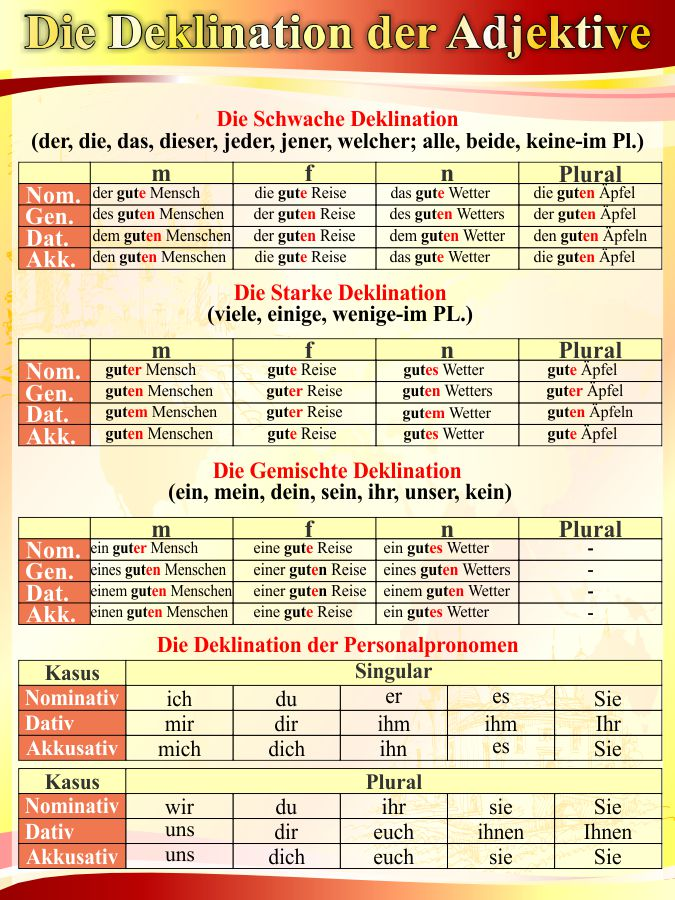

Als ich im Wald spazieren ging, habe ich **einem** Bären **begegnet**.

Die Tatsache, dass ich einen Opinel dabei hatte, hat **mir** nicht **geholfen**:

ich geriet in Panik und fing an zu rennen.

Das Opinel ist ein Messer, das **mir gehört** weil ich habe es von meinem Opa geerbt.

Aber eher als ein Messser, habe ich dann **mir gewünscht**  ich hätte Flügel.

Kurz danach habe ich einen anderen Wanderer getroffen und ich schrie ihn an: Lauf! Ein Bär !

Aber der Wanderer hat **mir gezeigt** dass es kein Bär war, sonst eine Kuh!

verkaufen D
das Obst=das Gemüse
die Frücht-die Früchte
gehören D
wünschen D
zeigen D
gefallen D

